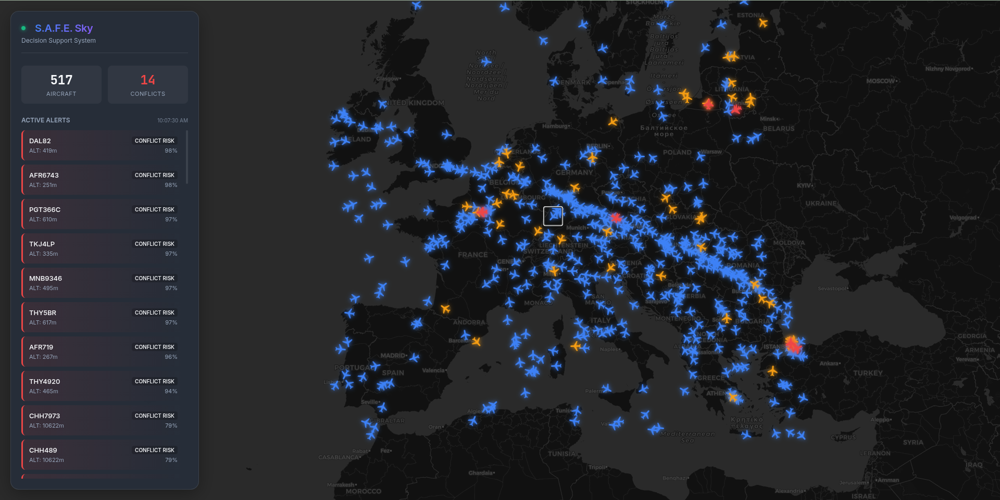

# S.A.F.E. Sky: AI-Powered Air Traffic Decision Support

S.A.F.E. Sky (System for Airflight Forecast & Evaluation) is an advanced decision support system for Air Traffic Control (ATC). It combines real-time data ingestion, machine learning-based conflict prediction, and a modern "Glassmorphism" visualization interface to enhance situational awareness for operators.



## Key Features

-   **Real-Time Monitoring**: Ingests live ADSB flight data via the OpenSky Network API.
-   **Dynamic Region Querying**: Automatically fetches traffic for the region currently viewed on the map.
-   **Conflict Detection**: Uses a Random Forest model & `BallTree` spatial indexing ($O(N \log N)$) to predict loss-of-separation risks in real-time.
-   **Anomaly Detection**: Identification of unusual kinematic behaviors using Isolation Forests.
-   **Resilient Architecture**: Auto-caching and fallback mechanisms ensure the dashboard remains functional even during API outages or rate-limiting.
-   **Modern UI**: Dark-themed, GPU-accelerated map interface with localized alerts and specific aircraft focus.

## Project Structure

```bash
.
├── backend/            # FastAPI Server & ML Inference
│   ├── app.py          # Main application entry point
│   ├── models/         # Pre-trained scikit-learn models
│   └── backup_snapshot.csv
├── frontend/           # Modern Web Dashboard
│   └── index.html      # Single-file Vanillla JS + Leaflet App
├── scripts/            # Training & Utility Scripts
│   ├── training_models.ipynb
│   └── downloading.py
└── datasets/           # Raw training data
```

## Setup & Usage

### Prerequisites
-   Python 3.9+
-   `pip`
-   A modern web browser (Chrome/Firefox/Edge)

### 1. Installation

Clone the repository and install dependencies:

```bash
git clone https://github.com/yourusername/ai-atc.git
cd ai-atc
pip install -r requirements.txt
```

### 2. Running the System

**Step A: Start the Backend**
The backend handles data fetching, ML inference, and API serving.

```bash
cd backend
uvicorn app:app --reload
```
*Server will start at `http://127.0.0.1:8000`*

**Step B: Launch the Dashboard**
You can simply open `frontend/index.html` in your browser, or serve it locally:

```bash
cd frontend
python -m http.server 8080
```
Then open `http://localhost:8080`.

## Architecture Details

-   **Backend**: Built with **FastAPI**. It manages a "stale-while-revalidate" cache for OpenSky data to prevent API rate limits from breaking the user experience.
-   **ML Pipeline**:
    -   *Conflict Model*: Trained on relative velocity, heading convergence, and vertical separation.
    -   *Anomaly Model*: Unsupervised learning (Isolation Forest) on kinematic vectors.
-   **Frontend**: Pure HTML/CSS/JS using **Leaflet.js** for mapping. Optimized for low-latency updates (20s polling interval).

## Disclaimer
This project is for research and demonstration purposes only. It is not intended for operational air traffic control use.
